<p align="center">
  
</p>

<p align="center">
  <a href="https://github.com/ishandutta2007/Awesome-Awesome-Awesome"></a>
  <a href="https://discord.gg/jc4xtF58Ve"></a>
  <a href="https://github.com/ishandutta2007/Awesome-Threat-Intelligence-Platform/stargazers"></a>
  <a href="https://github.com/ishandutta2007/Awesome-Threat-Intelligence-Platform/network/members"></a>
  <a href="https://github.com/ishandutta2007/Awesome-Threat-Intelligence-Platform/pulls"></a>
  <a href="https://github.com/ishandutta2007/Awesome-Threat-Intelligence-Platform/blob/main/LICENSE"></a>
  <a href="https://github.com/ishandutta2007"></a>
</p>

# 🛡️ Awesome Threat Intelligence Platform (TIP) Ecosystem 🌐

> **A curated index of top Enterprise SaaS platforms and Open-Source GitHub projects for Cyber Threat Intelligence (CTI), Threat Intelligence Platforms (TIPs), Indicators of Compromise (IOC) management, STIX 2.1/TAXII exchange, adversary TTP correlation, and automated SecOps enrichment.**

**Last updated: August 2026** 📅

---

## 📖 Table of Contents

- [🎯 Overview & SEO Insights](#-overview--seo-insights)
- [🏢 Enterprise SaaS Platforms](#-enterprise-saas-platforms)
- [⚡ Open-Source GitHub Projects](#-open-source-github-projects)
- [🏗️ Blueprint for Custom TIP Deployment](#️-blueprint-for-custom-tip-deployment)
- [🤝 How to Contribute](#-how-to-contribute)
- [📈 Star History](#-star-history)
- [📜 Disclaimer](#-disclaimer)

---

## 🎯 Overview & SEO Insights

**Cyber Threat Intelligence (CTI)** and **Threat Intelligence Platforms (TIPs)** empower Security Operations Centers (SOCs), Detection Engineers, and Incident Responders to aggregate, normalize, enrich, and operationalize high-volume threat data. 

Key pillars covered in this repository:
- 🔍 **Indicator Management & Normalization:** Ingesting, deduplicating, and scoring IOCs (IPs, domains, hashes, URLs).
- 🧠 **Adversary & TTP Contextualization:** Mapping threat actor campaigns to the **MITRE ATT&CK®** framework.
- 🔄 **Standardized Exchange:** Sharing feeds via **STIX 2.1** and **TAXII 2.1** protocols.
- ⚡ **Security Orchestration (SOAR & SIEM):** Direct bi-directional synchronization with Splunk, Elastic, Microsoft Sentinel, CrowdStrike, and Cortex.
- 🕵️ **Dark Web & Digital Risk Protection (DRP):** Monitoring underground forums, stealer logs, and credential breach dumps.

---

## 🏢 Enterprise SaaS Platforms

Below is the comparative breakdown of leading commercial Threat Intelligence Platforms, sorted descending by **Company Size (Valuation / Market Cap / Revenue)**:

| Platform 🏢 | Description 📝 | Valuation / Revenue 💰 | Starting Pricing 🏷️ | Free Tier / Trial Limits 🎁 |
| :--- | :--- | :--- | :--- | :--- |
| **[Mandiant Threat Intelligence](https://www.mandiant.com/)** | Frontline breach intelligence, adversary attribution, vulnerability intelligence, and strategic reporting powered by Google Cloud / Mandiant responders. | **~$2.2 Trillion** Market Cap *(Alphabet / Google Cloud ~$40B+ ARR)* | Starts at ~$40,000/year *(Mandiant Advantage standard tier; enterprise suites scale higher based on seats)* | **Free Forever Tier** with limited access to curated actor summaries & public IOCs; 14-day trial for full premium intelligence *(30-day trial for ASM)* |
| **[CrowdStrike Falcon Intelligence](https://www.crowdstrike.com/)** | Threat intelligence unified with Falcon endpoint telemetry, automated sandbox malware detonation, IOC enrichment, and adversary profiles. | **~$85 Billion** Market Cap *(~$3.9B ARR)* | Starts at $99.99/device/year *(Falcon Pro bundle, 5-device min. = $499.95/year)*; standalone intel modules start at ~$47/device/year | **No permanent free tier**; 15-day full-featured free trial *(no credit card required, up to 100 endpoints)* including integrated intel & automated sandbox detonations |
| **[Recorded Future](https://www.recordedfuture.com/)** | Cloud-based Threat Intelligence Cloud delivering real-time adversary analysis, SecOps intelligence, vulnerability prioritization, and dark web tracking. | **$2.65 Billion** Acquisition Valuation *(Mastercard subsidiary / $300M+ ARR)* | Starts at ~$25,000/year *(entry-level module)*; enterprise packages range $100,000–$250,000+/year | **No permanent free tier**; offers a 30-day free trial for SIEM integrations & free Express browser extension for basic lookups |
| **[Flashpoint](https://flashpoint.io/)** | Deep & dark web intelligence, illicit marketplace monitoring, compromised credentials, vulnerability intelligence, and physical security data. | **~$1.0 Billion** Valuation *(Audax Private Equity / $100M+ ARR)* | Starts at ~$35,000–$50,000/year for single modules; Ignite Cyber Threat Intel packages on AWS Marketplace list at $80,000–$100,000/year *(up to 5,000 users)* | **No permanent free tier**; 14-to-30-day Proof-of-Concept (POC) trial available upon sales verification with limited query credits |
| **[ThreatConnect](https://threatconnect.com/)** | TIP and cyber risk orchestration platform uniting indicator aggregation, analyst investigations, playbook automation, and Cyber Risk Quantification (CRQ). | **~$500 Million** Valuation *(Insight Partners / $60M–$80M ARR)* | Starts at ~$25,000–$40,000/year for base CTI analyst tier; full TC Complete enterprise packages average $80,000–$150,000+/year | **No permanent free tier**; 30-day guided evaluation / POC environment available upon sales engagement with capped user seats |
| **[Anomali (ThreatStream)](https://www.anomali.com/)** | High-volume IOC lifecycle management, multi-source feed ingestion, machine learning scoring, and bi-directional SIEM/SOAR orchestration. | **~$450 Million** Valuation *(GV, IVP / $90M–$100M ARR)* | Starts at ~$15,000–$25,000/year for base feeds/seats; enterprise deployments average ~$93,000–$150,000/year | **No permanent free tier**; 14-to-30-day guided POC trial upon sales qualification with capped indicator ingestion |
| **[Cyware](https://www.cyware.com/)** | Collaborative threat exchange (CTIX) and security orchestration platform enabling bi-directional STIX/TAXII threat sharing and automated SecOps enrichment. | **~$300 Million** Valuation *(Ten Eleven Ventures / $30M–$50M ARR)* | Starts at ~$30,000–$45,000/year for base CTIX platform; enterprise packages with orchestration (CSAP/CSOP) range $75,000–$120,000+/year | **No permanent free tier**; 14-to-30-day guided sandbox / POC trial provided upon sales qualification |
| **[Intel 471](https://intel471.com/)** | Adversary-centric intelligence tracking cybercriminal underground networks, ransomware syndicates, infostealer logs, and actor infrastructure. | **~$200 Million** Valuation *(Thoma Bravo / $30M–$45M ARR)* | Starts at ~$44,200/year *(£44,200/license/yr on UK Digital Marketplace)*; enterprise tiers average $60,000–$120,000/year | **No permanent core free tier** *(free SpiderFoot HX tier with 50 monthly scans)*; 30-day targeted trial / workshop access for threat hunting teams |
| **[EclecticIQ](https://www.eclecticiq.com/)** | STIX 2.x native intelligence platform featuring analyst workbench, graph-based data fusion, feed normalization, and dissemination into SIEM/EDR. | **~$200 Million** Valuation *(Ace Capital / $25M–$40M ARR)* | Starts at ~$35,000–$50,000/year for entry-level deployment; full enterprise instances average $75,000–$140,000/year | **No permanent platform free tier** *(free Threat Scout browser extension for observable extraction)*; 30-day integration test / TIP Bundle trial upon request |
| **[ThreatQuotient (ThreatQ)](https://www.threatq.com/)** | Threat operations platform and data engine that scores, prioritizes, deduplicates, and operationalizes threat intelligence across SOC workflows. | **~$175 Million** Valuation *(Cisco Investments / $35M–$50M ARR)* | Starts at ~$30,000–$45,000/year for baseline cloud instance with core integrations; enterprise tiers average $65,000–$110,000+/year without per-feed surcharges | **No permanent free tier**; 14-to-30-day guided Proof of Concept (POC) trial through vendor and partner channels |
| **[SOCRadar](https://socradar.io/)** | Extended Threat Intelligence (XTI) combining external attack surface management (EASM), digital risk protection (DRP), and dark web monitoring. | **~$100 Million** Valuation *(Peak / $15M–$25M ARR)* | Starts at $7,900/year *(~$658/month for Essential tier; Business tier starts at $14,750/year)* | **Free Forever Community Edition** with monthly search quota for Threat Investigation & 1 domain monitoring *(up to 50 assets)*; 7-to-14-day free trial for Business tier |

---

## ⚡ Open-Source GitHub Projects

The open-source CTI ecosystem provides complete flexibility, data sovereignty, and robust community sharing communities. Below are the top open-source projects, sorted descending by **GitHub Stars ⭐**:

1. **[OpenCTI](https://github.com/OpenCTI-Platform/opencti)** [](https://github.com/OpenCTI-Platform/opencti/stargazers)  
   Leading open-source Cyber Threat Intelligence platform built on **STIX 2.1**. Structures, stores, visualizes, and correlates technical and non-technical threat knowledge with a rich connector ecosystem and GraphQL API.

2. **[Maltrail](https://github.com/stamparm/maltrail)** [](https://github.com/stamparm/maltrail/stargazers)  
   Malicious traffic detection system utilizing publicly available blacklists, custom IOC feeds, and heuristic mechanisms to detect malicious DNS, HTTP, and IP communication.

3. **[MISP](https://github.com/MISP/MISP)** [](https://github.com/MISP/MISP/stargazers)  
   The most widely deployed open-source threat intelligence sharing and analysis platform. Collects, stores, correlates, and distributes IOCs and threat events with trusted ISAC/CERT community support.

4. **[TheHive](https://github.com/TheHive-Project/TheHive)** [](https://github.com/TheHive-Project/TheHive/stargazers)  
   Scalable, open-source Security Incident Response Platform (SIRP) tightly integrated with MISP and Cortex to manage security investigations and observable triage.

5. **[FireHOL Blocklists](https://github.com/firehol/blocklist-ipsets)** [](https://github.com/firehol/blocklist-ipsets/stargazers)  
   Real-time IP security blocklists and threat intelligence feeds curated, deduplicated, and updated every few minutes for firewalls and intrusion prevention systems.

6. **[Signature-Base](https://github.com/Neo23x0/signature-base)** [](https://github.com/Neo23x0/signature-base/stargazers)  
   Central open signature repository containing thousands of YARA rules, IOC indicators, C2 detection patterns, and regex definitions maintained by Florian Roth (Nextron Systems).

7. **[MITRE ATT&CK Navigator](https://github.com/mitre-attack/attack-navigator)** [](https://github.com/mitre-attack/attack-navigator/stargazers)  
   Interactive matrix visualization and exploration tool for mapping defensive coverage, detection engineering rules, and adversary techniques across ATT&CK matrices.

8. **[MITRE ATT&CK CTI](https://github.com/mitre/cti)** [](https://github.com/mitre/cti/stargazers)  
   Foundational open knowledge base and STIX 2.0/2.1 data repository of adversary tactics, techniques, and procedures (TTPs) ingested across threat intelligence systems.

9. **[FIR (Fast Incident Response)](https://github.com/certsocietegenerale/FIR)** [](https://github.com/certsocietegenerale/FIR/stargazers)  
   Cybersecurity incident management platform created by CERT Société Générale allowing CSIRTs and SOCs to track incidents, analyze IOCs, and track attacker telemetry.

10. **[Yeti](https://github.com/yeti-platform/yeti)** [](https://github.com/yeti-platform/yeti/stargazers)  
    Your Everyday Threat Intelligence platform designed to organize observables, indicators of compromise, TTPs, and malware repository triage with automated async enrichment.

11. **[Cortex](https://github.com/TheHive-Project/Cortex)** [](https://github.com/TheHive-Project/Cortex/stargazers)  
    Powerful observable analysis and active response engine that automates querying 100+ threat intelligence services (VirusTotal, Shodan, AbuseIPDB, Cuckoo).

12. **[Facebook ThreatExchange](https://github.com/facebook/ThreatExchange)** [](https://github.com/facebook/ThreatExchange/stargazers)  
    Standardized platform and Python SDK for querying and sharing security threat data and signals at scale between organizations.

13. **[MISP Warninglists](https://github.com/MISP/misp-warninglists)** [](https://github.com/MISP/misp-warninglists/stargazers)  
    Curated warning lists of well-known public indicators (CDNs, DNS resolvers, benign Microsoft domains) to avoid false positives in threat intelligence pipelines.

14. **[OpenCTI Connectors](https://github.com/OpenCTI-Platform/connectors)** [](https://github.com/OpenCTI-Platform/connectors/stargazers)  
    Ecosystem of official and community connectors importing and exporting intelligence between OpenCTI and dozens of services (MISP, ATT&CK, VirusTotal, AlienVault OTX, Cuckoo).

15. **[PyMISP](https://github.com/MISP/PyMISP)** [](https://github.com/MISP/PyMISP/stargazers)  
    Python client library and CLI to interact with MISP platforms via its REST API to add, update, tag, and export threat events and attributes programmatically.

16. **[STIX 2 Python APIs](https://github.com/oasis-open/cti-python-stix2)** [](https://github.com/oasis-open/cti-python-stix2/stargazers)  
    Official OASIS Open Python library for parsing, serializing, validating, and generating STIX 2.0 and STIX 2.1 Cyber Threat Intelligence objects.

17. **[MISP Modules](https://github.com/MISP/misp-modules)** [](https://github.com/MISP/misp-modules/stargazers)  
    Modular expansion, enrichment, import, and export services for MISP instances supporting DNS lookups, whois, malware sandboxes, and OSINT expansion.

18. **[OpenTAXII](https://github.com/eclecticiq/OpenTAXII)** [](https://github.com/eclecticiq/OpenTAXII/stargazers)  
    Robust Python implementation of TAXII server services maintained by EclecticIQ for automated, standards-based intelligence distribution.

19. **[ThreatKB](https://github.com/InQuest/ThreatKB)** [](https://github.com/InQuest/ThreatKB/stargazers)  
    Knowledge base and workflow manager for security operations teams to capture, edit, validate, and operationalize custom threat signatures and indicators.

---

## 🏗️ Blueprint for Custom TIP Deployment

```
                   ┌──────────────────────────────────────────────┐
                   │           External Threat Feeds              │
                   │  (OSINT, ISACs, Commercial, CERTs, Abuse.ch) │
                   └──────────────────────┬───────────────────────┘
                                          │
                                          ▼
                   ┌──────────────────────────────────────────────┐
                   │         MISP (Indicator Aggregation)         │
                   │   - Community Sharing & Taxonomies           │
                   │   - Fast Indicator De-duplication            │
                   └──────────────────────┬───────────────────────┘
                                          │ (STIX 2.1 Connectors)
                                          ▼
                   ┌──────────────────────────────────────────────┐
                   │      OpenCTI (Central Knowledge Graph)       │
                   │   - MITRE ATT&CK TTP Structuring             │
                   │   - Adversary Campaigns & Threat Actors      │
                   │   - Complex Graph Correlation & Visuals      │
                   └──────┬───────────────────────────────┬───────┘
                          │                               │
            (SOAR Enrichment & Webhooks)       (Detection-as-Code)
                          ▼                               ▼
       ┌─────────────────────────────────────┐  ┌─────────────────┐
       │     TheHive + Cortex Investigation  │  │  SIEM / EDR     │
       │  - Incident Case Management         │  │  (Elastic,      │
       │  - Observable Analysis (Cortex)     │  │   Splunk,       │
       │  - Active Containment Actions       │  │   CrowdStrike)  │
       └─────────────────────────────────────┘  └─────────────────┘
```

> [!TIP]
> Deploy **OpenCTI** as the central analyst workbench and knowledge graph (STIX-native), use **MISP** for high-volume IOC exchange with external sharing communities, and bridge both using official connectors. Push high-fidelity IOCs into your SIEM/EDR, while routing complex alerts to **TheHive + Cortex** for automated investigations.

---

## 🤝 How to Contribute

Contributions make the cyber defense ecosystem stronger! 🛡️

1. 🍴 **Fork the repository**
2. 🌿 **Create a feature branch** (`git checkout -b add-new-tip`)
3. 📝 **Add or update entries in `README.md`** following the established table / list format
4. 🔗 **Ensure links, pricing details, and star badges are accurate**
5. 🚀 **Submit a Pull Request** with a concise description of the addition

⭐ **Star this repository** if you find it helpful for your threat intelligence and security engineering work!

---

## 📈 Star History

[](https://star-history.dera.page/#ishandutta2007/Awesome-Threat-Intelligence-Platform&type=date&legend=top-left)

---

## 📜 Disclaimer

- This is a **community-curated index** for informational and educational purposes — not an endorsement.
- Threat intelligence platforms ingest and operationalize critical security indicators that influence automated detection, containment, and response decisions. Ensure appropriate access control, data verification, and human oversight.
- Always respect Traffic Light Protocol (**TLP**) markings, NDAs, and information-sharing agreements when exchanging intelligence.

---

<p align="center">
  <b>Built for CTI Analysts, Threat Hunters, SOC Engineers, and Incident Responders.</b><br>
  <i>Empowering collective cyber defense through structured, actionable, and open threat intelligence.</i>
</p>
